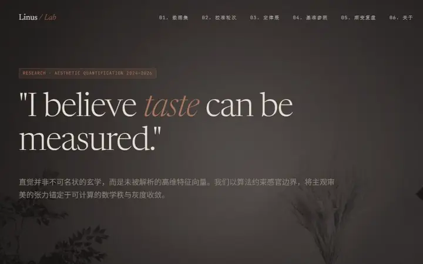
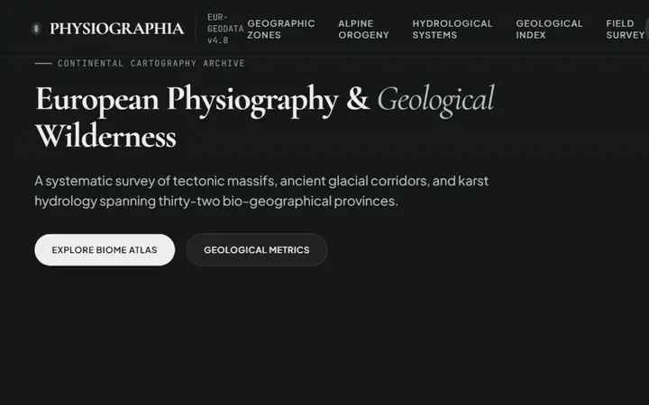
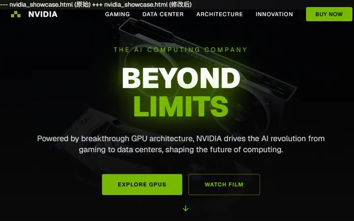
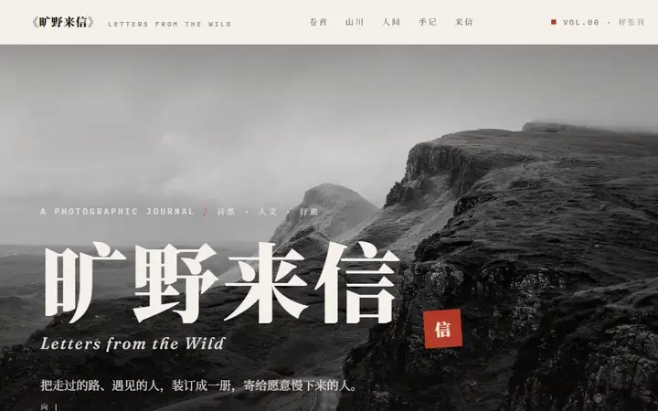
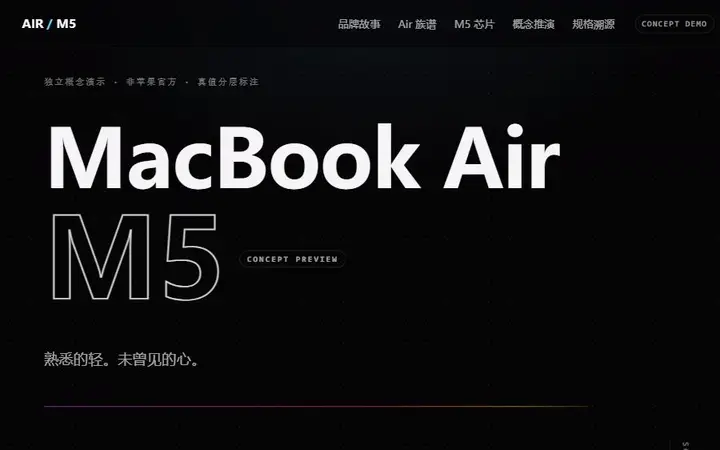
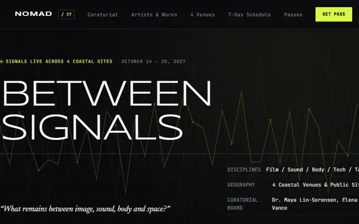
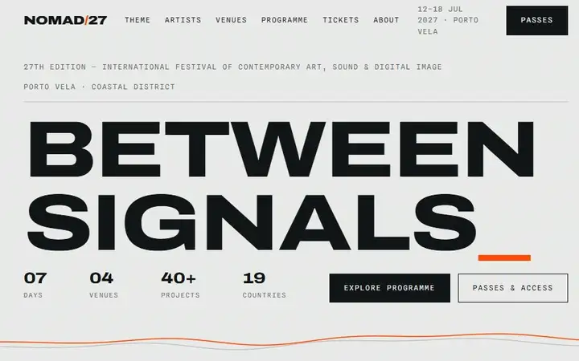
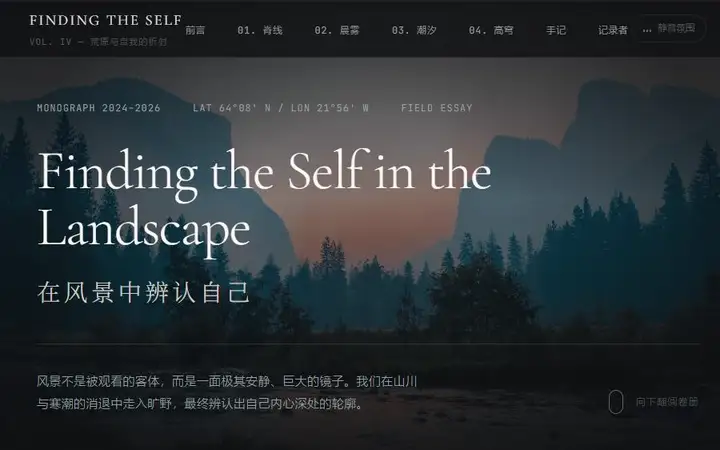

<p align="center"><a href="../">Taste Lab 首页</a> · <strong>Prompt Lab</strong> · <a href="../agent/">切换到 Agent Lab →</a></p>

<h1 align="center">Prompt Lab · 纯提示词路线</h1>

<p align="center">
  <strong>无需安装。选择一份 Markdown，与实际需求一起交给任意 AI。</strong><br>
  V0.0–V0.7 · 13 个原始 HTML · 当前版 V0.7
</p>

<p align="center">
  <a href="../archive/v0.7/TasteSkillAdaptive.md"></a>
  <a href="https://wanghexinyi.github.io/taste-lab/#prompt"></a>
  <a href="../agent/"></a>
</p>

### 怎么使用

1. 下载当前推荐版 [`TasteSkillAdaptive.md`](../archive/v0.7/TasteSkillAdaptive.md)，或者选择下方任一历史版本。
2. 在同一个对话中，把 Markdown 文件与你的产品需求、页面内容和技术限制一起发给 AI。
3. 明确要求 AI 完整阅读文件并把它当作执行规范，不要只总结文件。

可以直接复制：

```text
请完整阅读我附加的 Markdown 文件，并将它视为本次前端任务的设计、实现与验收规范。
请结合我接下来提供的实际需求执行；除非其中内容与我的明确要求冲突，否则严格遵守该文件中的流程、审美决策、交互和质量检查要求。
不要只总结或解释这份文件，请直接使用它完成任务，并在交付前自行检查结果。

我的具体需求：
（在这里填写页面、功能、内容、技术栈和其他限制）
```

如果平台不支持上传 Markdown，可以复制文件全文并粘贴到同一个对话。下面所有画面都由对应版本的原始 HTML 在浏览器中实际渲染；点击动图可以打开完整页面。

### V0.0 · 实验起点

**提示词：** [`TasteSkill.md`](../archive/v0.0/TasteSkill.md)

V0.0 原始目录没有 HTML，因此只保留 prompt-only 起点，不用其他版本的页面冒充它的效果。

---

### V0.1 · 从固定色板走向会话派生

**提示词：** [`TasteSkill--V10.2.md`](../archive/v0.1/TasteSkill--V10.2.md)

#### 审美量化实验 · Aesthetic Quantification Experiment

<a href="https://wanghexinyi.github.io/taste-lab/demos/v0.1/taste-quantification.html"></a>

**[▶ 打开完整交互 HTML](https://wanghexinyi.github.io/taste-lab/demos/v0.1/taste-quantification.html)**

---

### V0.2 · 开源基座与个人 override

**提示词：** [`OpenSkill.md`](../archive/v0.2/OpenSkill.md)

#### 01 · European Physiography & Geological Wilderness

<a href="https://wanghexinyi.github.io/taste-lab/demos/v0.2/physiographia-europaea.html"></a>

**[▶ 打开完整交互 HTML](https://wanghexinyi.github.io/taste-lab/demos/v0.2/physiographia-europaea.html)**

#### 02 · NVIDIA · 智能时代的引擎

<a href="https://wanghexinyi.github.io/taste-lab/demos/v0.2/nvidia-editorial.html"></a>

**[▶ 打开完整交互 HTML](https://wanghexinyi.github.io/taste-lab/demos/v0.2/nvidia-editorial.html)**

#### 03 · NVIDIA · Beyond Limits

<a href="https://wanghexinyi.github.io/taste-lab/demos/v0.2/nvidia-product.html"></a>

**[▶ 打开完整交互 HTML](https://wanghexinyi.github.io/taste-lab/demos/v0.2/nvidia-product.html)**

---

### V0.3 · 从视觉规则到决策架构

**提示词：** [`TASTE_SKILL_V3_SINGLE_FILE_TEST.md`](../archive/v0.3/TASTE_SKILL_V3_SINGLE_FILE_TEST.md)

#### 01 · 旷野来信 · Letters from the Wild

<a href="https://wanghexinyi.github.io/taste-lab/demos/v0.3/wilderness-letters.html"></a>

**[▶ 打开完整交互 HTML](https://wanghexinyi.github.io/taste-lab/demos/v0.3/wilderness-letters.html)**

#### 02 · 行迹考 · The Cartography of Solitude

<a href="https://wanghexinyi.github.io/taste-lab/demos/v0.3/cartography-of-solitude.html"></a>

**[▶ 打开完整交互 HTML](https://wanghexinyi.github.io/taste-lab/demos/v0.3/cartography-of-solitude.html)**

---

### V0.4 · Surface router 与功能 QA

**提示词：** [`TASTE_SKILL_V3.4_SINGLE_FILE_TEST.md`](../archive/v0.4/TASTE_SKILL_V3.4_SINGLE_FILE_TEST.md)

#### MacBook Air M5 · Concept Demo

<a href="https://wanghexinyi.github.io/taste-lab/demos/v0.4/macbook-air-m5-concept.html"></a>

**[▶ 打开完整交互 HTML](https://wanghexinyi.github.io/taste-lab/demos/v0.4/macbook-air-m5-concept.html)**

---

### V0.5 · 轻量工作流控制器

**提示词：** [`TASTE_SKILL_V4.1_LITE_SINGLE_FILE_TEST.md`](../archive/v0.5/TASTE_SKILL_V4.1_LITE_SINGLE_FILE_TEST.md)

#### 01 · Aman Kyoto · Gemini 3.7 Flash Extended

<a href="https://wanghexinyi.github.io/taste-lab/demos/v0.5/aman-kyoto-gemini.html"></a>

**[▶ 打开完整交互 HTML](https://wanghexinyi.github.io/taste-lab/demos/v0.5/aman-kyoto-gemini.html)**

#### 02 · Aman Kyoto · Qwen 3.8 Max

<a href="https://wanghexinyi.github.io/taste-lab/demos/v0.5/aman-kyoto-qwen.html"></a>

**[▶ 打开完整交互 HTML](https://wanghexinyi.github.io/taste-lab/demos/v0.5/aman-kyoto-qwen.html)**

---

### V0.6 · 构图与动效的网页端单文件版

**提示词：** [`taste_frontend_v4_4_web_rules.md`](../archive/v0.6/taste_frontend_v4_4_web_rules.md)

#### 01 · NOMAD / 27 · Gemini 3.7 Flash Extended

<a href="https://wanghexinyi.github.io/taste-lab/demos/v0.6/nomad-27-gemini.html"></a>

**[▶ 打开完整交互 HTML](https://wanghexinyi.github.io/taste-lab/demos/v0.6/nomad-27-gemini.html)**

#### 02 · NOMAD / 27 · Qwen 3.8 Max

<a href="https://wanghexinyi.github.io/taste-lab/demos/v0.6/nomad-27-qwen.html"></a>

**[▶ 打开完整交互 HTML](https://wanghexinyi.github.io/taste-lab/demos/v0.6/nomad-27-qwen.html)**

---

### V0.7 · Adaptive effort routing · Current Prompt

**提示词：** [`TasteSkillAdaptive.md`](../archive/v0.7/TasteSkillAdaptive.md)

#### 01 · 在风景中辨认自己 · Gemini 3.7 Flash Extended

<a href="https://wanghexinyi.github.io/taste-lab/demos/v0.7/landscape-self-gemini.html"></a>

**[▶ 打开完整交互 HTML](https://wanghexinyi.github.io/taste-lab/demos/v0.7/landscape-self-gemini.html)**

#### ⭐ 重点展示 · 在风景中辨认自己 · Qwen 3.8 Max

这条预览使用 **30 FPS、约 60 秒**的高帧率双倍慢速录制，让构图、滚动衔接与页面动画得到更完整的展示。

<a href="https://wanghexinyi.github.io/taste-lab/demos/v0.7/landscape-self-qwen.html"></a>

**[▶ 打开完整交互 HTML](https://wanghexinyi.github.io/taste-lab/demos/v0.7/landscape-self-qwen.html)**

---

<p align="center"><a href="../">← 返回路线选择</a> · <a href="../agent/">切换到 Agent Lab →</a></p>
